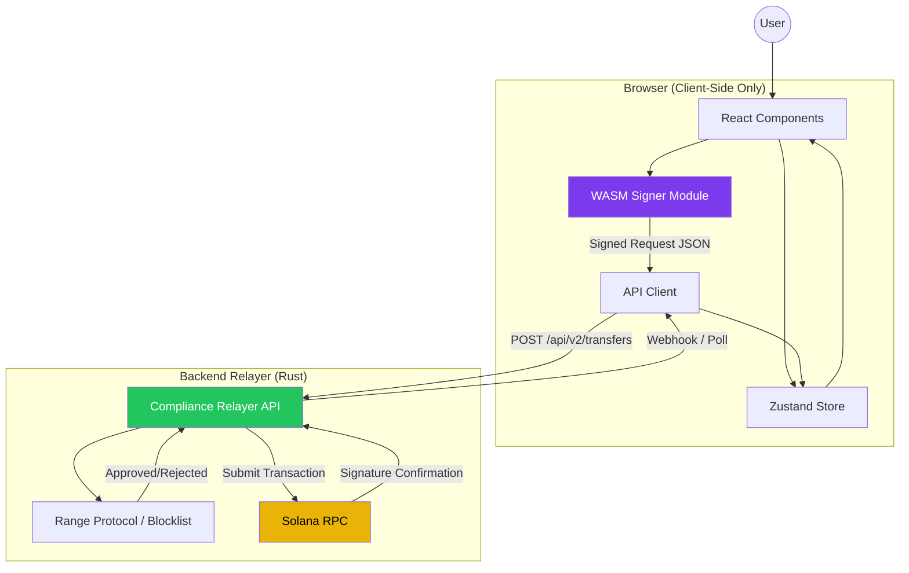
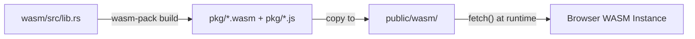
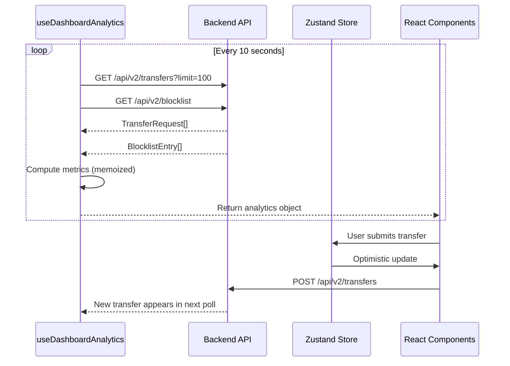

# Frontend Architecture

> **Solana Compliance Relayer** — A privacy-preserving, compliance-verified transfer interface for Solana.

This document provides a comprehensive architectural overview for senior engineers onboarding to the frontend codebase. It details the technology stack, design patterns, and critical subsystems that power the client application.

---

## Technology Stack

| Layer | Technology | Version | Purpose |
|-------|------------|---------|---------|
| **Framework** | Next.js | 16.x | App Router, Server Components, file-based routing |
| **Runtime** | React | 19.x | UI rendering with Concurrent Features |
| **Language** | TypeScript | 5.5+ | Static typing, strict mode enabled |
| **Styling** | Tailwind CSS | 4.x | Utility-first CSS with custom DeFi dark theme |
| **State** | Zustand | 5.x | Lightweight global state management |
| **Cryptography** | Rust/WASM | — | Client-side Ed25519 signing via `ed25519-dalek` |
| **Forms** | React Hook Form + Zod | 7.x / 4.x | Declarative form validation |
| **Charts** | Recharts | 3.x | Analytics visualizations |
| **Animation** | Framer Motion | 12.x | Micro-interactions and transitions |
| **UI Primitives** | Radix UI | — | Accessible, unstyled components (Select, Slot) |

---

## Architectural Diagram

The following diagram illustrates the data flow from user interaction through to blockchain submission:



**Key Security Invariant:** Private keys never leave the browser. The WASM module signs transactions in-memory, and only the resulting Ed25519 signature is transmitted to the backend.

---

## Directory Structure

```
solana-compliance-relayer-frontend/
├── src/
│   ├── app/                      # Next.js App Router
│   │   ├── (landing)/            # Route group for marketing/landing pages
│   │   ├── admin/                # Admin panel routes
│   │   ├── dashboard/            # Analytics dashboard route
│   │   ├── globals.css           # Global styles and Tailwind imports
│   │   ├── layout.tsx            # Root layout (dark mode, metadata)
│   │   └── page.tsx              # Home page (unified dashboard)
│   │
│   ├── components/               # Shared UI components
│   │   ├── dashboard/            # Dashboard-specific layouts
│   │   ├── shared/               # Cross-cutting components (SystemHealthBar)
│   │   └── ui/                   # Radix-based primitives (Button, Input, Select)
│   │
│   ├── features/                 # Feature-based modules (vertical slices)
│   │   ├── monitor/              # Transaction monitoring table
│   │   ├── risk-scanner/         # Pre-flight risk check UI
│   │   ├── terminal/             # Transfer form and mode toggle
│   │   ├── transfer/             # Transfer submission logic
│   │   └── wallet/               # Wallet display and keypair management
│   │
│   ├── hooks/                    # Custom React hooks
│   │   ├── useDashboardAnalytics.ts  # Polling + metrics computation
│   │   └── useHydrated.ts            # SSR hydration guard
│   │
│   ├── lib/                      # Core utilities
│   │   ├── constants.ts          # API URLs, configuration
│   │   ├── utils.ts              # Helper functions (cn, formatters)
│   │   └── wasm.ts               # WASM loader and typed wrappers
│   │
│   ├── services/                 # API service layer
│   │   ├── api-client.ts         # Generic fetch wrapper
│   │   ├── blocklist.ts          # Blocklist CRUD operations
│   │   ├── risk-check.ts         # /risk-check endpoint
│   │   ├── transactions.ts       # Transaction history fetching
│   │   ├── transfer-requests.ts  # Transfer request list/details
│   │   └── transfer.ts           # Transfer submission service
│   │
│   ├── shared/                   # Shared utilities and API re-exports
│   │   ├── api/                  # API module aggregation
│   │   └── lib/                  # Shared library functions
│   │
│   ├── store/                    # Global state (Zustand)
│   │   └── useUIStore.ts         # UI state: transfer mode, transactions, loading
│   │
│   ├── types/                    # TypeScript type definitions
│   │   ├── analytics.types.ts    # Dashboard analytics interfaces
│   │   ├── api.d.ts              # API response types
│   │   ├── risk-check.ts         # Risk check response types
│   │   ├── transaction.ts        # Transaction entity types
│   │   └── transfer-request.ts   # Transfer request DTOs
│   │
│   └── widgets/                  # Composed dashboard widgets
│       ├── AnalyticsOverview/    # Charts and security flags
│       ├── MetricsRow/           # KPI cards row
│       └── OperationalDashboard/ # Operational metrics panel
│
├── wasm/                         # Rust WASM crate
│   ├── Cargo.toml                # Rust dependencies
│   ├── src/
│   │   └── lib.rs                # Ed25519 signing logic
│   └── pkg/                      # Compiled WASM output (gitignored)
│
├── public/
│   └── wasm/                     # Production WASM artifacts
│       ├── solana_transfer_wasm_bg.wasm
│       └── solana_transfer_wasm_bg.js
│
├── tailwind.config.ts            # DeFi dark theme configuration
├── next.config.mjs               # Next.js WASM and webpack config
└── package.json                  # Dependencies and scripts
```

---

## The WASM Bridge

The WASM bridge is the security-critical subsystem that enables client-side transaction signing without exposing private keys to JavaScript or network transmission.

### Compilation Pipeline



**Build Command:**
```bash
cd wasm && wasm-pack build --target web --out-dir pkg
```

### Rust Crate Dependencies

| Crate | Purpose |
|-------|---------|
| `ed25519-dalek` | Ed25519 signature generation |
| `rand` + `getrandom` | Browser-compatible CSPRNG via `js` feature |
| `bs58` | Base58 encoding for Solana addresses/signatures |
| `serde` + `serde_json` | JSON serialization for API payloads |
| `wasm-bindgen` | Rust-to-JS FFI bindings |

### Exported Functions

```rust
#[wasm_bindgen]
pub fn generate_keypair() -> Result<String, JsValue>;

#[wasm_bindgen]
pub fn generate_public_transfer(
    secret_key_bs58: &str,
    to_address: &str,
    amount_lamports: u64,
    token_mint: Option<String>,
    nonce: &str,
) -> Result<String, JsValue>;

#[wasm_bindgen]
pub fn generate_random_address() -> String;
```

### TypeScript Integration

The `src/lib/wasm.ts` module provides typed async wrappers:

```typescript
// Lazy initialization (browser-only)
export async function initWasm(): Promise<WasmExports>;

// Generate new Ed25519 keypair
export async function generateKeypair(): Promise<KeypairResult>;

// Sign a transfer request (returns API-ready JSON)
export async function generatePublicTransfer(
  secretKey: string,
  toAddress: string,
  amountLamports: number,
  tokenMint: string | undefined,
  nonce: string
): Promise<TransferResult>;
```

### Signing Message Format

The v2 API requires a deterministic message format for signature verification:

```
{from_address}:{to_address}:{amount_lamports}:{token_mint|SOL}:{nonce}
```

Example:
```
7xKX...abc:9yMN...xyz:1000000000:SOL:019470a4-7e7c-7d3e-8f1a-2b3c4d5e6f7a
```

> [!CAUTION]
> Never transmit the `secret_key` outside the browser. The WASM module consumes it in-memory and produces only the signature for API submission.

---

## State Management Strategy

### Zustand Store (`useUIStore`)

The application uses a single Zustand store for cross-cutting UI state:

```typescript
interface UIState {
  // Transfer mode (public/private)
  transferMode: TransferMode;
  setTransferMode: (mode: TransferMode) => void;

  // Local transaction cache (optimistic updates)
  transactions: Transaction[];
  addTransaction: (tx: Transaction) => void;
  updateTransactionStatus: (id: string, status: Status) => void;

  // Loading states
  isSubmitting: boolean;
  setIsSubmitting: (value: boolean) => void;
}
```

### Real-Time Data Fetching

The `useDashboardAnalytics` hook implements a polling-based data synchronization strategy:

| Aspect | Implementation |
|--------|----------------|
| **Polling Interval** | 10 seconds |
| **Fetch Limit** | 100 most recent transfers |
| **Parallel Fetching** | Transfers + Blocklist via `Promise.all` |
| **Error Handling** | Graceful degradation with fallback empty states |
| **Memoization** | `useMemo` for all derived metrics |

**Computed Metrics:**
- Success Rate (confirmed / terminal transactions)
- Average Latency (created_at → updated_at delta)
- 24h Transaction Volume (hourly buckets)
- 7-Day Transaction Counts (daily buckets)
- Compliance Breakdown (approved / rejected / pending)

### Data Flow



---

## Routing Strategy

The application uses **Next.js 16 App Router** with the following conventions:

| Route | File | Description |
|-------|------|-------------|
| `/` | `src/app/page.tsx` | Unified home dashboard |
| `/dashboard` | `src/app/dashboard/page.tsx` | Analytics-focused view |
| `/admin` | `src/app/admin/page.tsx` | Administrative panel |

### Route Groups

- `(landing)/` — Marketing and public-facing pages (layout isolation)

### Layout Composition

```
RootLayout (dark mode, global styles)
└── Page-specific content
    └── Widgets (AnalyticsOverview, MetricsRow)
        └── Features (Terminal, Monitor, RiskScanner)
            └── UI Primitives (Button, Input, Select)
```

---

## UI/UX Patterns

### Design System

The application implements a custom **DeFi Dark Theme** via Tailwind CSS:

| Token | Value | Usage |
|-------|-------|-------|
| `background` | `#0b0f14` | Page background |
| `panel` | `#111722` | Card/container backgrounds |
| `panel-hover` | `#1a2332` | Interactive hover states |
| `border` | `#1f2a3a` | Subtle borders |
| `primary` | `#7c3aed` | Brand purple (actions, focus) |
| `status-confirmed` | `#22c55e` | Success states |
| `status-pending` | `#eab308` | Pending/warning states |
| `status-failed` | `#ef4444` | Error states |

### Component Patterns

| Pattern | Implementation | Example |
|---------|----------------|---------|
| **Skeleton Loading** | Tailwind `animate-pulse` with `bg-panel` | `AnalyticsSkeleton` |
| **Optimistic Updates** | Zustand immediate state + API confirmation | `addTransaction()` |
| **Form Validation** | React Hook Form + Zod schema | `TransferForm` |
| **Micro-Animations** | Framer Motion `fadeIn`, `slideIn` | Widget transitions |
| **Accessible Primitives** | Radix UI (Select, Slot) | `components/ui/` |

### Layout Components

| Component | Responsibility |
|-----------|----------------|
| `SystemHealthBar` | Global status indicator (API connectivity) |
| `AnalyticsOverview` | 24h volume chart + security flags |
| `MetricsRow` | KPI cards (success rate, latency, compliance) |
| `OperationalDashboard` | Detailed operational metrics |
| `Terminal` | Transfer form with mode toggle |
| `Monitor` | Transaction history table with status badges |

---

## Feature Modules

The codebase follows a **feature-based (vertical slice)** organization:

### `/features/terminal`

The primary transfer interface:
- `ModeToggle.tsx` — Public/Private transfer mode selector
- `TransferForm.tsx` — Amount, recipient, and token input with validation
- `hooks/` — Feature-specific custom hooks

### `/features/monitor`

Real-time transaction monitoring:
- `Monitor.tsx` — Main monitoring container
- `TransactionTable.tsx` — Scrollable, status-badged transaction list

### `/features/risk-scanner`

Pre-flight risk assessment tool:
- `RiskScanner.tsx` — Main scanner interface
- `ScanInput.tsx` — Wallet address input
- `ScanningProgress.tsx` — Animated progress indicator

### `/features/wallet`

Keypair management:
- Ephemeral keypair generation via WASM
- Secure key display with copy functionality

---

## API Integration

### Service Architecture

```
src/services/
├── api-client.ts       # Generic ApiClient class (singleton)
├── blocklist.ts        # fetchBlocklist()
├── risk-check.ts       # checkRisk()
├── transactions.ts     # getTransaction(), listTransactions()
├── transfer-requests.ts # listTransfers(), getTransferDetails()
└── transfer.ts         # submitTransfer()
```

### API Client Pattern

```typescript
class ApiClient {
  private baseUrl: string;

  async get<T>(endpoint: string): Promise<ApiResponse<T>>;
  async post<T>(endpoint: string, body: unknown): Promise<ApiResponse<T>>;
}

// Singleton export
export const apiClient = new ApiClient();
```

### Response Type

```typescript
type ApiResponse<T> =
  | { success: true; data: T }
  | { success: false; error: string };
```

---

## Build & Development

### Prerequisites

- Node.js 20+
- pnpm 9+
- Rust toolchain with `wasm-pack`

### Commands

```bash
# Install dependencies
pnpm install

# Compile WASM (required before first run)
cd wasm && wasm-pack build --target web --out-dir pkg && cd ..
cp wasm/pkg/solana_transfer_wasm_bg.* public/wasm/

# Development server
pnpm dev

# Production build
pnpm build

# Lint
pnpm lint
```

### Environment Variables

| Variable | Required | Description |
|----------|----------|-------------|
| `NEXT_PUBLIC_API_URL` | Yes | Backend Relayer API base URL |

---

## Security Considerations

| Concern | Mitigation |
|---------|------------|
| Private key exposure | Keys exist only in WASM memory; never serialized to JS heap |
| Replay attacks | UUID nonce included in signing message; backend enforces uniqueness |
| XSS/injection | React's JSX escaping + Zod input validation |
| CORS | Backend configures strict origin allowlists |
| WASM integrity | Production WASM served from same-origin `/public/wasm/` |

---

## Related Documentation

- [Backend Architecture](https://github.com/your-org/solana-compliance-relayer/blob/main/docs/ARCHITECTURE.md)
- [Technical Operations Guide](https://github.com/your-org/solana-compliance-relayer/blob/main/docs/OPERATIONS.md)
- [API Reference](https://github.com/your-org/solana-compliance-relayer/blob/main/docs/API.md)
